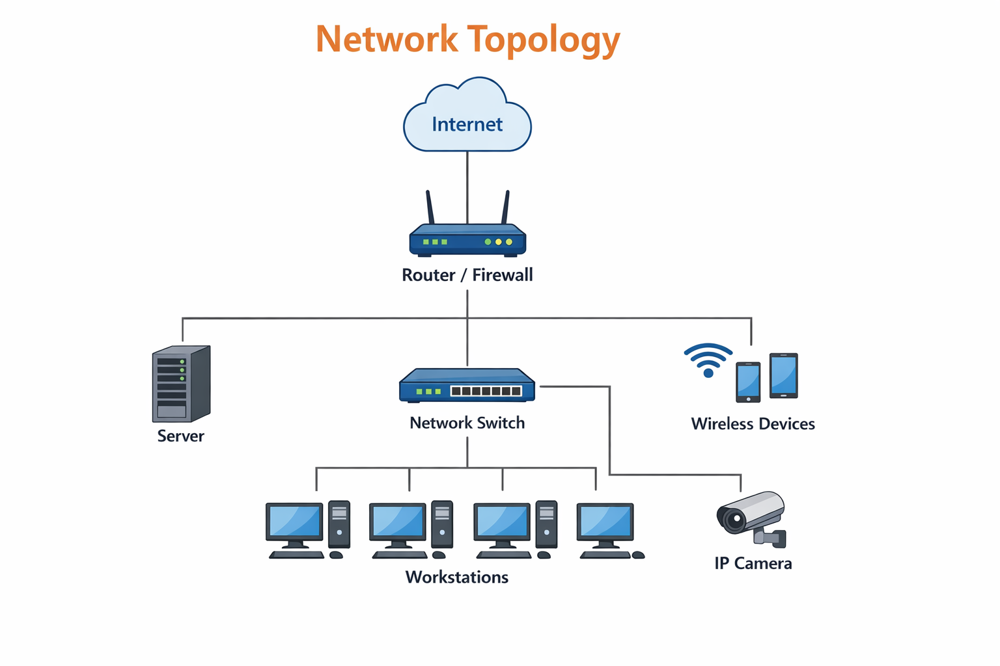

# Home Network Documentation

## Overview
This repository contains my home network documentation. It includes the Physical and Logical topologies, Addressing documentation, Network devices and servers/services, Devices configurations, and the method used to securely store login credentials.

For privacy reasons, some addressing information may be altered, but the overall network design remains accurate.

---

# Physical Network Document

## Physical Topology
The home network is centered in the common room where the main networking devices are installed. Devices are connected using both Ethernet cables and Wi-Fi.

### Physical Locations

**Common Room**
- ISP Modem
- Main Wireless Router
- 8-Port Switch
- Smart TV

**Bedroom**
- Laptop
- Printer

**Study Area**
- Desktop PC

**Multiple Rooms**
- Smartphones
- Tablet

### Interface Names and Connections

| Device | Interface | Connected To | Location | Connection Type |
|--------|----------|--------------|----------|----------------|
| ISP Modem | LAN1 | Router WAN | Common Room | Cat6 Ethernet |
| Router | WAN | ISP Modem | Common Room | Cat6 Ethernet |
| Router | LAN1 | Switch Port 1 | Common Room | Cat6 Ethernet |
| Switch | Port 2 | Desktop PC | Study Area | Cat6 Ethernet |
| Router | Wi-Fi | Laptop | Bedroom | Wireless |
| Router | Wi-Fi | Printer | Bedroom | Wireless |
| Router | Wi-Fi | Smart TV | Common Room | Wireless |
| Router | Wi-Fi | Phones/Tablet | Multiple Rooms | Wireless |

### Physical Topology Diagram

This physical network document accurately documents the location of all network devices, including interface names, physical locations, and cables, and provides a clear visual representation of the home network.

---

# Logical Network Document

## Logical Topology
The network uses a star topology where the router is the central device. All devices connect directly or indirectly through the router.

### Network Design
- Router provides DHCP, NAT, DNS, and wireless access
- Switch extends wired connectivity
- All devices are part of a single LAN network

### Network Information
- Network: 192.168.1.0/24
- Default Gateway: 192.168.1.1
- DHCP Range: 192.168.1.100 – 192.168.1.199

### Logical Topology Diagram

This logical network document provides a detailed and accurate representation of the network including topology, connectivity, and structure.

---

# Addressing Documentation

## IP Address Table

| Device | IP Address | Method |
|--------|-----------|--------|
| Router | 192.168.1.1 | Static |
| Switch | 192.168.1.2 | Static |
| Desktop | 192.168.1.10 | Static |
| Laptop | 192.168.1.100 | DHCP |
| Printer | 192.168.1.110 | DHCP |
| Smart TV | 192.168.1.120 | DHCP |
| Phone 1 | 192.168.1.130 | DHCP |
| Phone 2 | 192.168.1.131 | DHCP |
| Tablet | 192.168.1.140 | DHCP |

---

# Network Devices and Services

## Devices
- ISP Modem
- Wireless Router
- 8-Port Switch
- Desktop PC
- Laptop
- Printer
- Smart TV
- Smartphones
- Tablet

## Services
- DHCP (IP assignment)
- DNS (name resolution)
- NAT (Internet access)
- Firewall (security)
- Printing service

---

# Devices Configurations

## Router
- LAN IP: 192.168.1.1
- DHCP enabled
- Wi-Fi configured
- WPA2/WPA3 security enabled
- Default password changed

## Switch
- Connected to router
- Used for wired connections

## Desktop
- Wired connection
- Static or reserved IP

## Laptop
- Wi-Fi connection
- DHCP enabled

## Printer
- Wi-Fi connection
- DHCP reservation

## Smart TV
- Wi-Fi connection
- DHCP enabled

---

# Secure Storage of Login Credentials

Login credentials are stored using a password manager.

- Passwords are encrypted
- Strong master password is used
- Multi-factor authentication enabled
- No plain text storage

---

# Completeness

This documentation includes all required information:
- Physical topology
- Logical topology
- Addressing documentation
- Devices and services
- Configurations
- Credential security method

The document is organized and easy to understand.

---

# Overall Quality

This network documentation demonstrates a strong understanding of networking concepts and provides a clear, structured, and complete representation of a home network.
